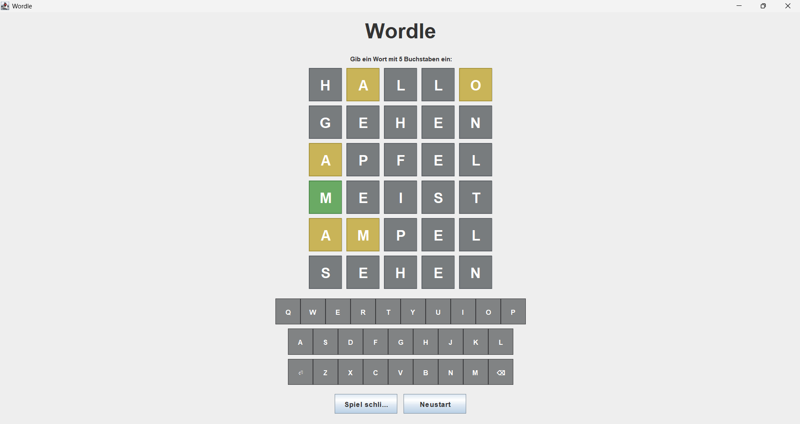

# Java Word Game
> Status: Finished

> Authors:
>  Julian Wappler
>  Marek Scholze
>  Lukas Rohne

## Game Overview

This project is a graphical Wordle-style word guessing game developed in Java.

The game uses a GUI that allows the player to interact with the application visually. Instead of using the command line, the player enters guesses through an on-screen keyboard.

The goal of the game is to guess a hidden five-letter word. After each guess, the letters are evaluated and displayed with different colors:

- Green: The letter is correct and in the correct position.
- Yellow: The letter exists in the word, but is in the wrong position.
- Gray: The letter is not part of the hidden word.

The game board shows all previous guesses, so the player can use the feedback to improve the next attempt.

The interface includes buttons to restart the game or close the application.

## Screenshot



## Features

- Graphical user interface built with Java
- Wordle-style five-letter word guessing gameplay
- Visual feedback for each guess
- Green tiles for correct letters in the correct position
- Yellow tiles for correct letters in the wrong position
- Gray tiles for letters that are not part of the word
- On-screen keyboard
- Restart button
- Close game button
- Java SE 11 compatibility
- No external libraries required

## Tech Stack


| Technology | Purpose |
|------------|---------|
| Java | Main programming language |
| Eclipse | Development environment (IDE) |
| Git | Version control |
| GitHub | Repository hosting and documentation |
| Stack Overflow | Research and problem solving |
| ChatGPT | Development support and debugging |
| Markdown | Project documentation |

## Software Bill of Materials

This project does not currently require a separate Software Bill of Materials because it does not use any external third-party libraries or additional `.jar` dependencies.

The application only relies on the Java Standard Library provided by Java SE 11.

## Requirements

To build and run this project, Java 11 or newer is required.

Recommended development environment:

- Java JDK 11 or newer
- Eclipse IDE or another Java-compatible IDE

Check Java installation:

```cmd
java -version
javac -version
```
### Windows PowerShell

Compile the project:

```powershell
javac -encoding UTF-8 -d bin -sourcepath src src/main/Main.java
```

Run the project:

```powershell
java -cp bin main.Main
```

Clean generated build files:

```powershell
Remove-Item -Recurse -Force out
```


